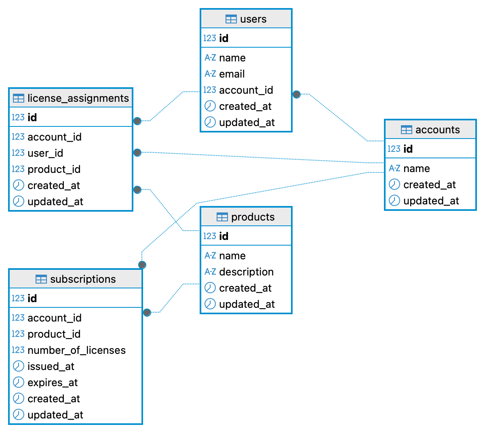

# License manager

Rails MVC application to manage licenses and assign licenses to users.

Functionalities include management of:
- Accounts
- Subscriptions
- Products
- License Assignments

##  App Dependencies
- Ruby 3.2.2
- Postgres 16
- Rails 8.0.2+
- Testing with RSpec
- Containerization with default Docker & Docker Compose

### Tests

To run the tests
```Bash
 $ bundle exec rspec
```

# Database ERD




# Local dev and Configuration

Note: __I've only developed using the dev container so the database is tied to it.__

To build the container go to:
```Bash
$ cd .devcontainer
```

and execute a docker compose up:
```Bash
$ docker compose up
```

Then to connect use:
```
$ docker exec -it license_manager-rails-app-1 bash
```
If you renamed the container, you can use `docker ps` to check the name.

After connecting you're gonna need to install dependencies and prepare the database.

A standard rails setup would look like:
```Bash
$ bundle install & bundle exec rails db:create db:migrate db:seed
```

And finally to run the server (using dev docker it's important to bind to 0.0.0.0):

```Bash
$ bin/dev -b 0.0.0.0
```

It will be listening on port 3000 -> go to http://localhost:3000 on your browser